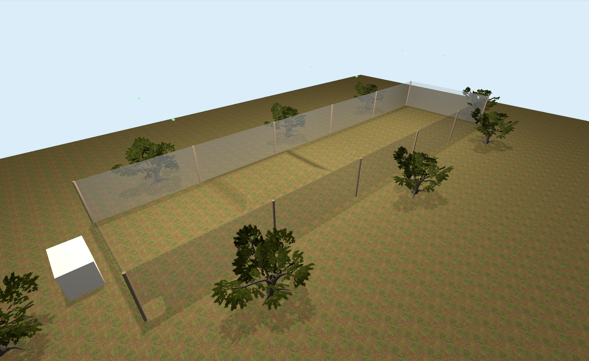

# Autonomy Park SITL



Gazebo Harmonic SITL with custom SDFs of the Homebrew quadcopters and of the UF Autonomy Park. Homebrews run PX4 v1.16.2 with a ROS 2 Humble bridge.

## Layout

| Path | What it is |
|---|---|
| `PX4-Autopilot/` | PX4 flight stack (submodule, pinned to v1.16.2) |
| `Micro-XRCE-DDS-Agent/` | DDS agent that bridges PX4's uXRCE-DDS client to ROS 2 (submodule, pinned to 2.4.3, unused currently) |
| `ros2_ws/src/px4_msgs/` | ROS 2 message definitions for PX4 (submodule, pinned to v1.16, unused currently) |
| `ros2_ws/src/aero_common/` | MAVROS-based autonomy stack: telemetry, teleop, safety, viz (submodule) — see [Running the SITL](#running-the-sitl) |
| `ros2_ws/src/apark_rise_controller/` | RISE trajectory-tracking controller experiments — see [Running an experiment](#running-an-experiment-apark_rise_controller) |
| `px4-additions/` | Custom model, world, and parameters — see [Custom assets](#custom-assets-px4-additions) |
| `scripts/` | Setup, build, and launch scripts, described below. `scripts/lib/` holds helpers the scripts below call internally — you shouldn't need to run anything in there directly. |

## Prerequisites

### Ubuntu 22.04
Find an ISO at <https://releases.ubuntu.com/jammy/>. This SITL is untested with Docker, but we have one at
<https://github.com/UFL-Autonomy-Park/ros2-docker/> that works on Windows and Mac (see container tags).
Pass-through of the Gazebo GUI is not available on Mac. You might want to avoid Gazebo on Mac for other reasons, namely CV work (confer: <https://docs.px4.io/v1.16/en/simulation/>). The authors have personally experienced other Mac bugs with Gazebo in Docker.

### ROS 2 Humble
Install per <https://docs.ros.org/en/humble/Installation.html>. **NOT** installed by `init.sh`.

### Gazebo Harmonic
Install per <https://gazebosim.org/docs/harmonic/install_ubuntu/> (`gz sim`,
tested with 8.15.0). **NOT** installed by `init.sh`.

### MAVROS
Will be installed by `init.sh` (tested with 2.15.0).

### geodesy
Will be installed by `init.sh`.

### Git LFS
Will be installed by `init.sh`.

## First-Time Setup

```bash
./scripts/init.sh
```

Installs above prequisites, initializes all submodules (including PX4's own nested submodules),
and installs PX4's own SITL build dependencies (into a project-local Python venv, `venv_host/`).
Safe to re-run. If something fails, the
error names the exact step and command, so just fix that and re-run.

## Building the SITL

Rebuilds PX4 SITL from a clean state — re-run after changing anything under
`px4-additions/`:

```bash
./scripts/build_px4.sh
```

Builds every package under `ros2_ws/src` with `colcon` — re-run after
changing anything there:

```bash
./scripts/build_ros2_autonomy_stack.sh
```

| Script | Purpose |
|---|---|
| `scripts/build_px4.sh` | Syncs `px4-additions/` into `PX4-Autopilot/` and rebuilds PX4 SITL from a clean state. Run after changing anything under `px4-additions/`. |
| `scripts/build_ros2_autonomy_stack.sh` | Builds every package under `ros2_ws/src` with `colcon`. Run after changing anything there or after cloning for the first time. |

## Running the SITL

Only a single Homebrew instance has been tested so far — this runs
`ros2_ws/src/aero_common`'s single-agent launch file, which connects MAVROS
to PX4 SITL's default MAVLink port; the multi-agent launch files under
`aero_common/minimal_startup_air/launch/` are untested against this SITL.

Each command below runs in the foreground and stays alive until you
`Ctrl-C` it — run each in its own terminal, in order:

Terminal 1 — launches a standalone Gazebo instance (no PX4 yet) and stays
alive. Loading the world is the slow part, so run this once and leave it
running:

```bash
./scripts/launch_gazebo.sh
```

Terminal 2 — once Gazebo is ready, spawns a single PX4 instance against it
and stays alive. Re-run this any time you want to reset the vehicle's pose
— it resets and re-attaches to the existing model rather than reloading the
world. Refuses to run (with an explanatory error) if Gazebo isn't up yet,
and if Gazebo quits out from under it (e.g. you `Ctrl-C` Terminal 1), it
notices within a second and stops PX4 too rather than hanging:

```bash
./scripts/launch_one_homebrew.sh
```

Terminal 3 — once PX4 is ready, launches minimal startup from the autonomy stack at `https://github.com/UFL-Autonomy-Park/aero_common`.

```bash
./scripts/launch_ros2_autonomy_stack.sh
```

To reset just the vehicle without restarting Gazebo, re-run Terminal 2's
command (it does this automatically), or run this from any terminal, any
time:

```bash
./scripts/lib/kill_all_px4_instances.sh
```

| Script | Purpose |
|---|---|
| `scripts/launch_gazebo.sh` | Launches a standalone Gazebo instance (no PX4). Run once; leave it running. |
| `scripts/launch_one_homebrew.sh` | Spawns a single PX4 instance against an already-running Gazebo (errors if Gazebo isn't up yet). Re-run any time to reset the vehicle's pose — kills any previous PX4 instance, then resets and re-attaches to the existing model rather than recreating it. |
| `scripts/lib/kill_all_px4_instances.sh` | Kills whatever PX4 instance `launch_one_homebrew.sh` last spawned (and any in-flight `apark_rise_controller` experiment riding on it), without touching Gazebo or the vehicle model. Safe to run any time. |
| `scripts/launch_ros2_autonomy_stack.sh` | Launches MAVROS + the autonomy stack. Run after `scripts/launch_one_homebrew.sh`. |

### Reference Code (`apark_rise_controller`)

Once Terminals 1–3 above are all up, run a single RISE controller experiment
(takeoff, tracks a trajectory, then lands) in its own terminal (Terminal 4)

```bash
./scripts/launch_rise_controller.sh
```

Results are written under `simulation_data/` in the workspace's root directory.

## Custom Assets (`px4-additions/`)

- `models/homebrew/` — the flight model: includes `homebrew_base` plus
  sensor plugins (`LW20` downward LiDAR, `OakD-Lite` depth camera representing
  our ZED 2 cameras, and `optical_flow` sensors).
- `models/homebrew_base/` — the airframe body and motor meshes (`meshes/*.stl`,
  tracked via Git LFS).
- `params/22000_gz_homebrew` — the PX4 airframe startup script. Autostart
  ID `22000` — the start of PX4's own officially reserved range for custom
  models (see the `[22000, 22999] Reserve for custom models` comment in
  `PX4-Autopilot/ROMFS/px4fmu_common/init.d-posix/airframes/CMakeLists.txt`).
- `worlds/autonomy_park.sdf` (+ `worlds/materials/`) — the UF Autonomy Park
  world, textures tracked via Git LFS.

## Customization
Most simulation tweaks occur by changing variables in `scripts/sitl_env.sh` or by editing files in `px4-additions` and rebuilding PX4.

### Physical Model Changes
The variable `PX4_SIM_MODEL` dictates the physical and aesthetic model used for the quadcopter. Whatever the quadcopter model name is, you must pretend `gz_` to `PX4_SIM_MODEL`. For example, to use the `x500` model, write `gz_x500`.

### PX4 Parameter Changes
The variable `PX4_SYS_AUTOSTART` dictates the set of parameters PX4 uses. These parameters are listed in `px4-additions` (e.g., `22000_gz_homebrew`). Note that anything past the 5-digit prefix number is a purely aesthetic label and doesn't need to be set anywhere or match the physical model used. If a parameter is not specified in this file, that means it uses the default for the given PX4 version (1.16.2) for a quadrotor.

### Spawn Location/Pose
The variable `PX4_GZ_MODEL_POSE` dictates the set of parameters PX4 uses is specified in `scripts/sitl_env.sh`. Easier automation for this will come in a future update.

### Multiple Agents
Multi-agent simulation is not yet supported. Feel free to fork and put in a PR though.

## Using This SITL for Resarch (Forking)

This SITL keeps moving — physics, collision handling, and scripts all get
revised over time. If you're using it as the basis for research you intend
to submit or publish, **don't fork and start working from `main` directly**. A later release
(even one made in good faith) can break your result or code. Fork the repo and pin your
work to a tagged release instead, as follows.

### Pinning to a Release

1. Fork the repo on GitHub, then clone **your fork** (not this
   repo):
   ```bash
   git clone <your-fork-url>
   ```
   `--recurse-submodules` isn't needed here — `scripts/init.sh` (step
   2/10) runs `git submodule update --init --recursive` for you, which
   also covers nested submodules (e.g. PX4-Autopilot's own NuttX/MAVLink).
2. See what tagged releases exist: `git tag --list`, or check this
   repo's Releases page.
3. Check out the tag your work is based on, onto a new branch — a bare
   `git checkout <tag>` leaves you in a detached-HEAD state, which isn't
   somewhere you want to commit your own changes:
   ```bash
   git checkout -b my-research <tag>
   ```
4. Do your work on `my-research`. Nothing merged into this repo's `main`
   after that tag will ever reach your branch unless you deliberately pull
   it in (e.g. `git fetch upstream && git merge <newer-tag>`) — that's the
   point. Anyone re-running your experiment later just needs your fork and
   your commit/tag, not whatever `main` happens to look like by then.

### After Forking, Before You Start

A few things a fork inherits as-is from this repo and that you'll likely
want to change:

- **Project directory name.** `scripts/sitl_env.sh` locates the repo root
  by looking for a directory literally named `autonomy_park_sitl` in your
  `$PWD` (falling back to "one level up from `scripts/`" otherwise). If you
  rename the cloned folder, double check that fallback still resolves
  correctly for how you run these scripts.
- **Submodule remote.** `.gitmodules`'s `ros2_ws/src/aero_common` entry
  still points at the `UFL-Autonomy-Park` org's own copy (`PX4-Autopilot`,
  `Micro-XRCE-DDS-Agent`, and `px4_msgs` all point at their respective
  upstream projects instead, not a UFL fork). That's fine if you're only
  changing files under `px4-additions/` or `ros2_ws/src/` — but if your
  research also modifies `aero_common` itself, fork *that* repo too and
  repoint that one entry at your fork of it; forking this outer repo alone
  won't do that for you.
- **Git LFS quota.** Meshes and textures are tracked via Git LFS. Your
  fork doesn't inherit the upstream org's LFS storage/bandwidth allowance —
  depending on your GitHub plan, a fresh clone of your fork may need its
  own LFS quota to succeed.

### Adding Your Own ROS 2 Package

`ros2_ws/src/apark_rise_controller/` is included as **reference code, not
a template to rename**. Rather than repurposing it, drop your own package
in alongside it:

1. Put your package under `ros2_ws/src/<your_package>/` (`ament_python` or
   `ament_cmake`, whichever fits) — the normal way to add any ROS 2
   package to a workspace. `scripts/build_ros2_autonomy_stack.sh` builds
   everything under `ros2_ws/src/` with `colcon` automatically; you don't
   need to register it anywhere else.
2. Look at `apark_rise_controller` for how a node here talks to the rest
   of the stack, not for code to copy into your own package:
   - It subscribes/publishes under the same namespace MAVROS was launched
     with (see `launch_ros2_autonomy_stack.sh`), matched via a launch
     argument (`launch/rise_controller.launch.py`'s `namespace`).
   - It pulls `park_coordinates.yaml` (from `px4_telemetry`) and
     `safety_config.yaml` (from `px4_safety_lib`) in as ROS parameters at
     launch, rather than duplicating those values, so it stays in sync
     with `aero_common`'s own idea of the world bounds and safety
     envelope.
   - It uses acceleration-level control.
3. `scripts/launch_rise_controller.sh` + `scripts/lib/kill_rise_controller.sh`
   are a template for a long-running experiment script, not something
   specific to `apark_rise_controller` — the `setsid` + pidfile + trap
   pattern they use (see the comments in either file) is what every
   `launch_*.sh`/`kill_*.sh` pair in this project follows, so it's a
   reasonable starting point to copy for your own node if it also needs to
   be started/stopped as a standalone experiment.
4. If your node flies the vehicle, remember it'll keep streaming setpoints
   at a vehicle that's about to be reset unless something kills it first —
   `scripts/lib/kill_all_px4_instances.sh` currently only kills
   `apark_rise_controller`'s experiment for exactly this reason
   (`kill_rise_controller.sh`). Add an equivalent call for your own node's
   kill script there if you want the same protection, and consider adding
   its process pattern to `scripts/kill_all_force.sh`'s `PATTERNS` list too.

## Troubleshooting

> [!WARNING]
> All scripts in this SITL source a file called `sitl_env.sh`
which sets `ROS_LOCALHOST_ONLY=1`
and unsets any config (`FASTRTPS_DEFAULT_PROFILES_FILE`,
`ROS_DISCOVERY_SERVER`, `RMW_IMPLEMENTATION`) your `~/.bashrc` might set. If
you need to echo topics from the SITL, run `source scripts/ros_sources.sh` first
(sources `sitl_env.sh` plus `ros2_ws/install/setup.bash` in one step). Otherwise,
while topics may display, they will never echo any messgaes! Since there is only
one `ros2` daemon on any system, this is not fixable. If a topic listing looks wrong
or need to do real-world robotics work, run `ros2 daemon stop` and run the scripts
you need to ensure the `ros2` daemon uses the config in `scripts/sitl_env.sh`.

> [!IMPORTANT]
> When respawning a PX4 instance (e.g., `launch_one_homebrew.sh`),
you much re-launch your autonomy stack (e.g., `launch_ros2_autonomy_stack.sh`)

> [!WARNING]
> Avoid landing on the hill. Despite extensive debugging, the quadcopter can get stuck in the ground
> and may not be able to takeoff again. Taking off a freshly-spawned model from ordinary ground level is usually fine.

> [!TIP]
> If something is stuck badly enough that the scripts above (`Ctrl-C`, or
their matching `kill_*.sh`) aren't cutting it, `scripts/kill_all_force.sh`
is a last-resort nuclear option: it `SIGKILL`s every Gazebo/PX4/ROS 2
process this project can start, machine-wide, with no graceful shutdown
(any vehicle currently flying will not land).

## Bugs and Feature Requests

Use GitHub Issues on this repo:
<https://github.com/UFL-Autonomy-Park/autonomy_park_sitl/issues>. For a bug,
include the SITL version/commit you're on, the exact command(s) that
triggered it, and any other applicable detail (be very descriptive!)/ If you're
building on a tagged release (see
[Using This SITL for Research](#using-this-sitl-for-resarch-forking)),
mention the tag too, since a fix on `main` may already apply to it.
Keep feature requests light; this repo was a lot of work.
